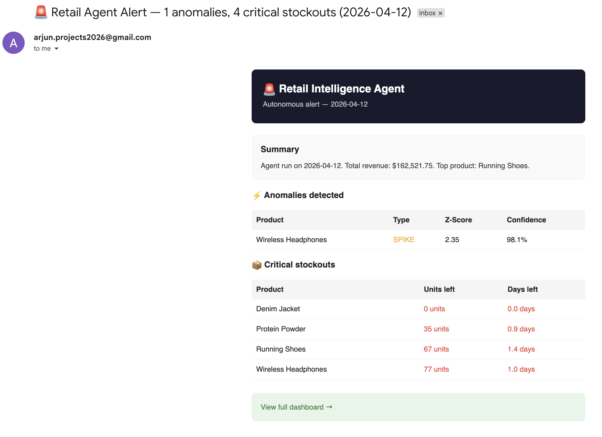

# Retail Intelligence Agent

> An autonomous AI agent that monitors retail performance, detects statistical 
> anomalies and sends proactive email alerts on a schedule, without any human input.

**Live Demo:** [retail-agent-self.vercel.app](https://retail-agent-self.vercel.app)  
**Backend API:** [retail-agent-backend.onrender.com/docs](https://retail-agent-backend.onrender.com/docs)  
**Author:** Arjun A N

---

## What are we looking at?

Most AI projects are **reactive**: a user types a question, an LLM answers it.

This project is **autonomous**: the agent wakes up every hour, decides which tools 
to call, reasons over real retail data, detects statistical anomalies, and sends 
formatted email alerts. Nobody triggers it. Nobody tells it what to do. It just runs.

This is the architectural shift from "AI chatbot" to "AI agent" 
It reflects how production AI systems are actually being built in 2026.

---

## The problem it solves!

Retail operations teams are drowning in data but starved for insight. A store running 
10+ product lines across categories cannot realistically monitor:

- Which products are spiking or crashing in sales?
- Which SKUs are days away from a stockout?
- Which categories are underperforming vs. their baseline?

A human analyst checking dashboards manually can do this once a day, maybe. An 
autonomous agent can do it every hour, surface only what matters statistically, 
and send a plain-English alert with specific recommendations.

**Target users:** Retail operations managers, inventory planners and e-commerce 
business owners who need continuous intelligence without building a data team.

---

## How it works:

### 1. Data layer
A Python simulator generates 60 days of realistic retail sales history across 10 
products in 3 categories (Electronics, Apparel, Health). The simulator introduces:

- Day-to-day noise (±30% variance)
- Weekend sales boosts (1.3x multiplier)
- Random anomaly events (5% spike probability, 3% crash probability)
- Automatic restocking when inventory runs low

All data is stored in **SQLite** via **SQLAlchemy**. lightweight; zero infrastructure; 
runs anywhere.

### 2. The tools (what the agent can do)
The agent has 5 Python functions registered as callable tools:

| Tool | What it does |
|---|---|
| `query_sales_db` | Pulls last N days of sales, grouped by product, sorted by revenue |
| `detect_anomalies` | Z-score statistical analysis flags products beyond ±2.0 standard deviations with confidence scoring |
| `get_inventory_status` | Returns stock levels per product with estimated days of stock remaining |
| `save_report` | Persists the agent's final JSON report to SQLite database |
| `send_alert_email` | Sends formatted HTML email when anomalies or critical stockouts are detected |

These tools are plain Python functions. The agent orchestrates them in sequence and 
passes all results to the LLM for reasoning.

### 3. Z-score anomaly detection

The anomaly engine uses proper statistical analysis — not simple thresholds.

For each product, it computes:
- **30-day mean** (μ): average daily units sold over the past month
- **Standard deviation** (σ): the natural variance in that product's sales
- **Z-score** = (recent 3-day avg − μ) / σ

A z-score beyond ±2.0 means the product is more than 2 standard deviations from 
its mean — a statistically significant event with ~95% confidence it is not random noise.

Example output:
Wireless Headphones — SPIKE
Z-score: 2.35 | Confidence: 98.1%
Recent avg: 91.0 units vs mean: 40.3 ± 21.61

This is how anomaly detection works at scale in production retail systems.

### 4. The agent brain
The agent uses **Llama 3.3 70B** (via **Groq API** — free tier) as its reasoning engine.

The agent loop works in two stages:

**Stage 1: Tool execution (Python-orchestrated)**  
Python calls all 5 tools in sequence and collects their outputs. All key metrics 
(revenue totals, top products, category breakdowns) are pre-computed in Python 
before being passed to the LLM — this eliminates hallucination entirely. The LLM 
writes the narrative, Python does the arithmetic.

**Stage 2: LLM reasoning**  
All tool outputs are passed to the LLM in a single prompt. The LLM reasons over 
the data and produces a structured JSON report with:
- A natural language summary using exact pre-computed numbers
- A list of detected anomalies with z-scores and confidence percentages
- Inventory alerts with days of stock remaining
- 3 specific, data-grounded recommendations

This two-stage design separates concerns cleanly — Python handles tool execution 
reliability, the LLM handles reasoning quality.

### 5. Email alerts: The action layer

When the agent detects anomalies or critical stockouts (less than 2 days of stock 
remaining), it automatically sends a formatted HTML email alert. No human trigger. 
No manual check required.

The email includes:
- Anomaly table with product name, type, z-score and confidence percentage
- Critical stockout table with units remaining and days left
- Direct link to the live dashboard
- Sent via Gmail SMTP — zero infrastructure cost



### 6. Agent reasoning trace

Every run produces a full reasoning trace — visible on the dashboard — showing 
exactly what the agent observed and why it made each decision at every step. This 
makes the LLM's reasoning transparent and auditable, not a black box.

Step 1 → Query sales database     → establish baseline performance
Step 2 → Z-score anomaly detection → flag statistical outliers with confidence
Step 3 → Inventory check           → identify stockout risks
Step 3.5 → Send alert email        → act on critical findings immediately
Step 4 → LLM reasoning             → synthesize all findings into report
Step 5 → Save report               → persist to database for dashboard

### 7. The scheduler
**APScheduler** runs the full agent loop every hour as a background job inside the 
FastAPI server. On startup, the server seeds the database and starts the scheduler 
automatically. No cron jobs. No external orchestration. Just a Python process.

- Server starts
- Seed database (if empty)
- Start background scheduler
- Every hour → add today's data → run agent → save report

### 8. The API
**FastAPI** exposes the agent and its data through 5 REST endpoints:

| Method | Endpoint | Description |
|---|---|---|
| GET | `/health` | Server status + scheduler state |
| POST | `/run-agent` | Trigger the agent manually |
| GET | `/reports/latest` | Most recent agent report with sales snapshot |
| GET | `/reports` | Full report history |
| GET | `/sales-data?days=N` | Raw sales data for charting |

Full interactive API documentation auto-generated at `/docs`.

### 9. The dashboard
A **React + Vite** frontend visualizes everything in real time:

- 4 stat cards: 7-day revenue, units sold, out-of-stock count, anomaly count
- Bar chart of revenue by product — sourced from the exact same data the agent analyzed
- LLM-generated summary using pre-computed exact figures (no hallucination)
- Anomaly alerts with z-score and confidence percentage
- Inventory alerts with days of stock remaining
- 3 actionable LLM recommendations grounded in real data
- Agent reasoning trace — 5-step decision log showing the agent's full chain of thought
- "Run Agent Now" button: triggers the backend and updates the dashboard live

---

## Tech stack

| Layer | Technology | Role |
|---|---|---|
| LLM | Llama 3.3 70B (Groq) | Reasoning engine — free, fast |
| Anomaly detection | Z-score statistics | Production-grade outlier detection |
| Email alerts | Gmail SMTP (smtplib) | Autonomous action layer |
| Backend | FastAPI | REST API + agent orchestration |
| Scheduler | APScheduler | Hourly autonomous agent runs |
| Database | SQLite + SQLAlchemy | Persistent data store |
| Data generation | Python + Faker | Realistic synthetic retail data |
| Frontend | React + Vite | Live dashboard |
| Charts | Recharts | Revenue visualization |
| HTTP client | Axios | Frontend ↔ backend communication |
| Backend hosting | Render (free tier) | Always-on API server |
| Frontend hosting | Vercel (free tier) | Global CDN deployment |

**Total infrastructure cost: $0**

---

## Running locally

**Prerequisites:** Python 3.11+, Node.js 18+

```bash
# 1. Clone the repo
git clone https://github.com/Arjunn28/retail-agent.git
cd retail-agent

# 2. Set up Python environment
python -m venv venv
source venv/bin/activate  # Windows: venv\Scripts\activate
pip install -r requirements.txt

# 3. Configure environment variables
cp .env.example .env
# Edit .env and fill in your keys
```

`.env` file structure:

GROQ_API_KEY=your_groq_api_key

ALERT_EMAIL_SENDER=your_gmail@gmail.com

ALERT_EMAIL_PASSWORD=your_gmail_app_password

ALERT_EMAIL_RECEIVER=your_gmail@gmail.com

```bash
# 4. Seed the database with 60 days of retail data
python -m backend.simulator

# 5. Start the backend
uvicorn backend.main:app --reload --port 8000

# 6. Start the frontend (new terminal)
cd frontend
npm install
npm run dev
```

Open `http://localhost:5173` — the dashboard loads with live data.  
Open `http://localhost:8000/docs` — interactive API documentation.

---

## Real-world applications

This architecture directly maps to production use cases being built right now:

- **E-commerce ops:** Automated hourly inventory risk reports with email alerts
- **Retail chains:** Statistical anomaly detection across hundreds of SKUs without analyst overhead
- **Supply chain:** Proactive stockout warnings before they impact revenue
- **Category management:** LLM-generated reorder recommendations grounded in real sales velocity

The same agent pattern — scheduled tool-calling loop + LLM reasoning over results — 
is used in production systems at companies building AI-native operations tooling.

---

## What makes this AI engineering, not just AI

| Typical AI project | This project |
|---|---|
| User asks → LLM answers | Agent runs on schedule, no user needed |
| Single LLM call | Multi-tool orchestration loop |
| Simple threshold detection | Z-score statistics with confidence scoring |
| Stops at insight | Sends real email alerts — action layer |
| Hardcoded logic | LLM decides what to say, Python computes the numbers |
| Static output | Live dashboard updates on every run |
| Local script | Deployed, publicly accessible system |
| No memory | Persistent report history over time |

---

## Author

**Arjun A N**  
[GitHub](https://github.com/Arjunn28) · [Live Demo](https://retail-agent-self.vercel.app)

---

> ⚠️ **Note on hosting:** Backend runs on Render's free tier, which spins down after 
> 15 minutes of inactivity. First request after sleep takes ~60 seconds to wake up. 
> This is a hosting limitation, not an application one. In production this would run 
> on a dedicated instance.